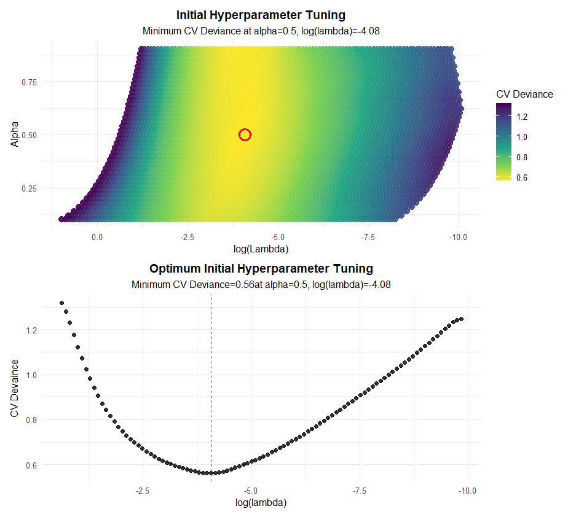
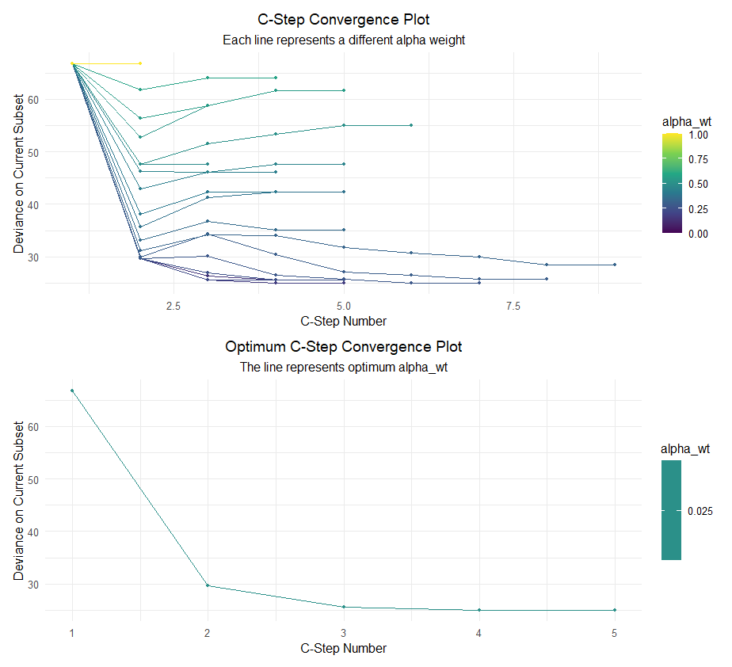

```{r, include = FALSE}
knitr::opts_chunk$set(
  collapse = TRUE,
  comment = "#>",
  fig.path = "man/figures/README-",
  out.width = "100%"
)
```

# RobENetLog

## Intro

This is an R package for binary classification problems for both low and high dimensional highly correlated data. Two main objectives of this method are features selection and outliers detection. The method is under construction and being tested with comprehensive simulation studies as well as real world data sets such as NCI-60, Parkinson's, etc. The project will be extended to linear regression, multi-nomial classification and other generalized linear models. Moreover, I am working on manuscript to put this method together which will also be a part of my dissertation. The method will be public in GitHub. Check out the following interesting plots. Stay tuned for updates!!



